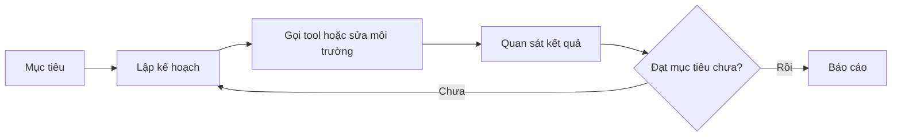

# LLM, Assistant và Agent

LLM, assistant và agent thường bị dùng lẫn lộn. Sự lẫn lộn này làm các quyết định kỹ thuật trở nên mơ hồ. Khi một người nói “agent”, có thể họ đang nói về một chatbot có tool, một workflow tự động, một coding assistant trong IDE, hoặc một hệ thống nhiều agent phối hợp.

## LLM

LLM là lõi sinh ngôn ngữ và suy luận trên token. Nó không tự biết file system, không tự gọi API, không tự nhớ lâu dài, không tự có quyền deploy. Tất cả những thứ đó là do hệ thống xung quanh cung cấp.

## Assistant

Assistant là lớp sản phẩm hoặc runtime bao quanh LLM. Nó có instruction, history, UI, tool list và policy. Assistant có thể trả lời câu hỏi, gọi vài tool, hỏi lại người dùng và trình bày kết quả. Nhưng nhiều assistant vẫn hoạt động theo kiểu phản hồi từng lượt, chưa thật sự có kế hoạch dài hạn.

## Agent

Agent có mục tiêu, vòng lặp hành động và tiêu chí dừng. Agent không chỉ trả lời “nên làm gì”, mà có thể thực hiện các bước như đọc repo, sửa code, chạy test, phân tích lỗi, sửa tiếp và báo cáo. Agent vì vậy cần state, trace, permission và evaluation.

## Checklist phân loại

- **Có tool không?** Nếu không, thường chỉ là LLM hoặc assistant text-only.
- **Có state qua nhiều bước không?** Nếu không, khó gọi là agent.
- **Có tự chọn hành động không?** Nếu chỉ chạy script cố định, đó là automation hơn là agent.
- **Có trace để audit không?** Nếu không, chưa đủ điều kiện production.
- **Có policy cho side effect không?** Nếu không, agent có thể gây hại ngoài ý định.
