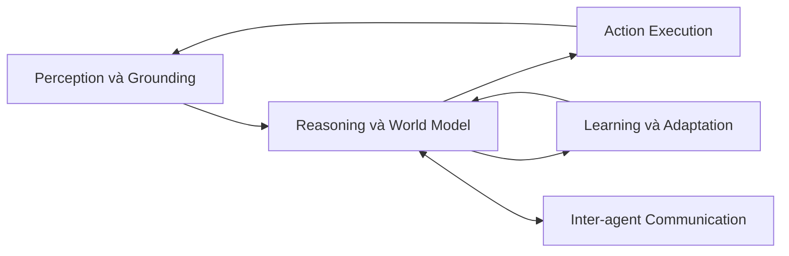

# Năm phân hệ chức năng của Agentic System

Khi nhìn một agentic system đang chạy, dễ có cảm giác mọi thứ xảy ra trong một mô hình ngôn ngữ. Thực tế, mô hình chỉ là một thành phần. Để hiểu hệ thống cư xử thế nào và hỏng ở đâu, ta nên tách nó thành năm phân hệ chức năng. Cách tách này không phải framework cụ thể, mà là một mental model giúp đặt câu hỏi engineering đúng chỗ.

## 1. Reasoning và World Model

Phân hệ này biến mục tiêu thành kế hoạch và quyết định. Nó duy trì mô hình thế giới của agent: agent đang ở task nào, đã làm gì, còn lại gì, tin gì là đúng, không chắc về điều gì. Mô hình thế giới càng rõ, plan càng có khả năng thực thi đúng.

Khi reasoning sai, triệu chứng thường là plan không bám vào dữ liệu thật, agent tự tin với giả định sai, hoặc agent không phát hiện ra task đã đổi yêu cầu. Sửa reasoning không chỉ là đổi prompt, mà còn là cấp đúng context, đúng tool và đúng evaluator.

## 2. Perception và Grounding

Agent không nhìn thế giới trực tiếp. Nó thấy thế giới qua context: file, tool output, log, search result, observation từ workflow. Perception là quá trình lấy dữ liệu này. Grounding là việc gắn dữ liệu vào thực thể có thật: file nào, dòng nào, user nào, ticket nào, thời điểm nào.

Khi perception yếu, agent dễ trộn dữ liệu khác task, đọc nhầm version cũ hoặc bỏ qua thông tin then chốt. Khi grounding yếu, agent nói đúng về một thứ không tồn tại. Hai lỗi này thường bị quy nhầm cho “model bị ảo giác”, trong khi gốc rễ nằm ở pipeline cấp ngữ cảnh.

## 3. Action Execution

Đây là phân hệ thực sự chạm vào thế giới: gọi tool, ghi file, chạy command, gửi request. Action execution đòi hỏi tool schema rõ, permission đúng và side effect được mô tả. Nó cũng cần observation chất lượng để vòng lặp tiếp theo có dữ liệu mới.

Hỏng phân hệ này không phải lỗi “model dùng tool sai” một mình. Có thể là tool description mơ hồ, output không đủ thông tin để quyết định bước tiếp, hoặc retry policy không phân biệt lỗi tạm thời và lỗi vĩnh viễn.

## 4. Learning và Adaptation

Một số agentic system học theo nghĩa fine-tuning. Hầu hết hệ thống thực dụng học theo nghĩa adaptation: cập nhật memory dài hạn, ghi quyết định, lưu pattern thành công, đưa failure mode vào eval. Adaptation tốt biến mỗi run thành dữ liệu cải thiện hệ thống thay vì chỉ artifact một lần.

Adaptation yếu khiến team lặp lại cùng lỗi qua nhiều phiên. Adaptation quá rộng khiến hệ thống học cả pattern sai. Vì vậy, ranh giới giữa “nên ghi nhớ” và “nên quên” phải được thiết kế chứ không phải mặc định.

## 5. Inter-agent Communication

Khi có nhiều agent hoặc khi agent giao việc qua các runtime, phân hệ này quyết định contract: ai nói gì, dưới schema nào, qua kênh nào và với thẩm quyền nào. Inter-agent communication không chỉ là “gọi agent khác”. Nó là một interface giữa các trách nhiệm.

Hỏng phân hệ này thường biểu hiện thành ảo giác phối hợp: agent trao đổi nhiều nhưng artifact cuối không kiểm chứng được, hoặc một agent giả định quyền mà agent gọi không thực sự có.

## Bản đồ chẩn đoán theo phân hệ

| Triệu chứng | Phân hệ nghi vấn |
|---|---|
| Kế hoạch lệch yêu cầu thật | Reasoning |
| Trả lời đúng về thực thể không tồn tại | Perception và Grounding |
| Tool gọi đúng nhưng dùng sai môi trường | Action Execution |
| Lặp lại cùng lỗi qua nhiều phiên | Learning và Adaptation |
| Nhiều agent đồng ý sai cùng nhau | Inter-agent Communication |

## Kết luận

Năm phân hệ không thay thế cho framework cụ thể. Chúng giúp đặt câu hỏi engineering đúng chỗ: hỏng ở reasoning thì sửa context và evaluator, hỏng ở perception thì sửa pipeline ngữ cảnh, hỏng ở action thì sửa tool và permission, hỏng ở learning thì sửa memory và eval, hỏng ở communication thì sửa contract giữa các vai trò. Cách đặt câu hỏi này là tài sản kỹ thuật quan trọng hơn việc thuộc tên framework.
