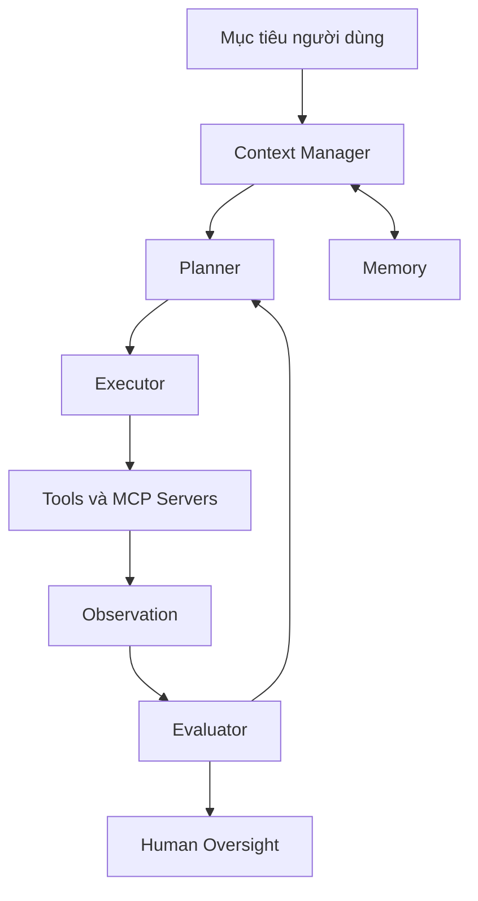

# Tổng quan Anatomy của Agent

Một agent không nên được hiểu như một hộp đen “biết tự làm”. Nếu chỉ nhìn agent như một thực thể thông minh duy nhất, ta sẽ rất khó thiết kế, debug và kiểm soát nó. Cách tiếp cận kỹ thuật hơn là phân rã agent thành các bộ phận có trách nhiệm rõ ràng. Khi một agent thất bại, ta không hỏi chung chung “model có thông minh không”, mà hỏi thành phần nào trong anatomy đã thất bại.

Hãy tưởng tượng một đội kỹ thuật xử lý incident. Có người nhận yêu cầu, có người lập giả thuyết, có người chạy lệnh kiểm tra, có người đọc log, có người quyết định rollback, có người ghi biên bản. Nếu mọi việc đều nằm trong đầu một người và không ai ghi lại quá trình, incident rất khó audit. Agent cũng vậy. Một hệ thống tốt cần tách phần lập kế hoạch, phần thực thi, phần quản lý context, phần gọi tool, phần kiểm tra kết quả và phần xin phê duyệt.

## Bản đồ thành phần

Sơ đồ này không nói rằng mọi agent đều phải có đủ từng khối như một module riêng biệt. Nó nói rằng mọi agent đều phải giải quyết các trách nhiệm tương ứng. Một coding assistant nhỏ có thể gộp planner và executor trong cùng một loop. Một workflow production có thể tách chúng thành node riêng. Một enterprise agent có thể đặt human oversight và permission engine bên ngoài model.

## Các thành phần chính

Planner quyết định chiến lược. Nó chia mục tiêu thành bước, chọn thứ tự hành động và nhận ra khi kế hoạch cần đổi. Executor thực hiện bước cụ thể: đọc file, gọi tool, chạy test, tạo artifact. Tool interface biến ý định thành lời gọi có schema, giới hạn input và chuẩn hóa output. Context manager chọn thông tin nào cần đưa vào model ở mỗi thời điểm. Memory lưu thông tin có thể dùng lại, nhưng phải có nguồn gốc và chính sách hết hạn. Evaluator kiểm tra kết quả, phân loại lỗi và quyết định có cần vòng lặp tiếp theo không. Human oversight xử lý vùng rủi ro, mơ hồ hoặc có side effect lớn.

Điều quan trọng là các thành phần này có lỗi khác nhau. Planner có thể chia task sai. Executor có thể gọi tool sai. Context manager có thể bỏ sót file. Tool interface có thể mơ hồ. Memory có thể lỗi thời. Evaluator có thể quá dễ dãi. Human approval có thể xuất hiện quá muộn hoặc quá mơ hồ.

## Tại sao anatomy quan trọng

Khi agent thất bại, câu hỏi đầu tiên không nên là “model ngu hay thông minh”. Câu hỏi đúng là thành phần nào thất bại. Planner có chia task sai không? Context có thiếu file quan trọng không? Tool schema có mơ hồ không? Evaluator có bỏ qua lỗi test không? Human approval có bị đặt quá muộn không?

Cách phân rã này giúp ta sửa root cause thay vì chỉ tăng model size hoặc viết prompt dài hơn. Nếu agent gọi nhầm tool vì tên tool mơ hồ, model lớn hơn chưa chắc giải quyết được. Nếu agent sửa code nhưng không chạy test vì repo không ghi command, vấn đề nằm ở repo readiness. Nếu agent đọc output độc hại từ webpage và làm theo, vấn đề nằm ở boundary giữa data và instruction.

## Anatomy và mức độ tự chủ

Agent càng tự chủ, anatomy càng cần rõ. Một assistant chỉ gợi ý code có thể chấp nhận evaluator nhẹ. Một agent tự tạo pull request cần kiểm thử, diff review và permission boundary. Một agent có quyền deploy production cần identity, audit, approval và rollback. Không thể dùng cùng một thiết kế cho mọi mức tự chủ.

Một cách thực dụng là bắt đầu với autonomy thấp: observe, analyze, draft. Khi trace và eval chứng minh hệ thống đáng tin hơn, mới mở quyền act with approval, sau đó rất cẩn trọng với act autonomously. Anatomy giúp ta biết cần thêm control nào trước khi tăng quyền.

## Kết luận

Anatomy của agent là ngôn ngữ để nói về trách nhiệm. Khi trách nhiệm rõ, ta có thể thiết kế tốt hơn, debug nhanh hơn và đặt governance đúng chỗ. Một agent mạnh không phải agent có ít thành phần nhất, mà là agent có các trách nhiệm được phân bổ rõ, có thể quan sát và có thể kiểm soát.
