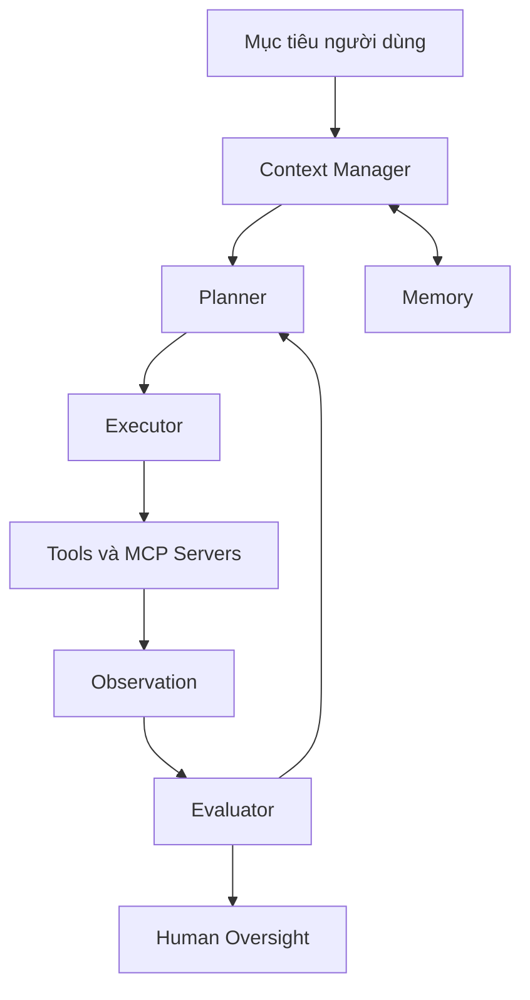

# Tổng quan Anatomy của Agent

Một agent không nên được hiểu như một hộp đen “biết tự làm”. Ta cần phân rã nó thành các bộ phận có trách nhiệm rõ ràng. Phân rã này giúp thiết kế tốt hơn, debug dễ hơn và kiểm soát rủi ro tốt hơn.

Các thành phần cơ bản gồm planner, executor, tool interface, memory, context manager, evaluator và human oversight. Không phải agent nào cũng có đủ mọi thành phần. Nhưng nếu thiếu một thành phần, hệ thống phải có cơ chế khác bù lại.

## Bản đồ thành phần

Planner quyết định chiến lược. Executor thực hiện bước cụ thể. Tool interface biến ý định thành lời gọi có schema. Memory lưu thông tin có thể dùng lại. Evaluator kiểm tra kết quả. Human oversight xử lý vùng rủi ro, mơ hồ hoặc có side effect lớn.

## Tại sao anatomy quan trọng

Khi agent thất bại, câu hỏi đầu tiên không nên là “model ngu hay thông minh”. Câu hỏi đúng là thành phần nào thất bại. Planner có chia task sai không? Context có thiếu file quan trọng không? Tool schema có mơ hồ không? Evaluator có bỏ qua lỗi test không? Human approval có bị đặt quá muộn không?

Cách phân rã này giúp ta sửa root cause thay vì chỉ tăng model size hoặc viết prompt dài hơn.
