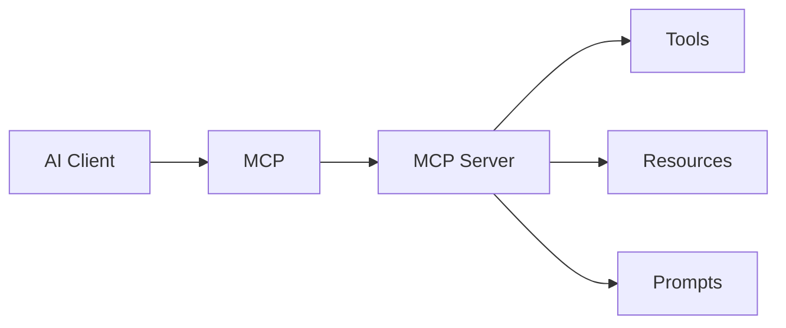

# Tổng quan MCP và Tool Protocols

Khi agent bắt đầu dùng tool, ta gặp một vấn đề quen thuộc của software engineering: nếu mỗi tool được tích hợp theo một cách riêng, hệ thống sẽ nhanh chóng rối. Mỗi client phải biết cách gọi từng API, cách lấy schema, cách đọc dữ liệu, cách xử lý lỗi và cách hiểu quyền hạn. MCP xuất hiện để chuẩn hóa một phần của bài toán đó: làm sao để AI client kết nối với tool, resource và prompt server theo một protocol chung.

Hãy hình dung MCP như một cổng kết nối giữa AI client và thế giới bên ngoài. Thay vì hard-code từng integration trong client, ta có MCP server expose capability có cấu trúc. Client có thể khám phá tool, gọi tool, đọc resource và dùng prompt template mà không cần biết chi tiết implementation bên dưới.

## MCP giải quyết vấn đề gì

MCP giải quyết ba vấn đề chính. Thứ nhất là interoperability: cùng một AI client có thể kết nối nhiều server theo cách tương đối thống nhất. Thứ hai là separation of concerns: team xây client không cần nhúng mọi integration vào client. Thứ ba là capability packaging: một MCP server có thể đóng gói kiến thức về domain, auth, API và output format.

Trong thực tế, MCP đặc biệt hữu ích với các capability như search tài liệu, đọc issue tracker, query database read-only, lấy deployment status, truy cập knowledge base hoặc tạo draft artifact. Nó giúp agent làm việc với môi trường thật mà không biến prompt thành danh sách API thủ công.

## Tool, resource và prompt

MCP thường phân biệt ba loại capability:

| Loại | Ý nghĩa | Ví dụ |
|---|---|---|
| Tool | Hành động agent có thể gọi với input có schema | search docs, create ticket, run query |
| Resource | Dữ liệu có thể đọc theo URI hoặc định danh | file, document, record, issue |
| Prompt | Template instruction hoặc prompt snippet | summarize incident, review diff |

Phân biệt này quan trọng vì chúng có rủi ro khác nhau. Tool có thể có side effect. Resource thường read-only nhưng vẫn có thể chứa dữ liệu nhạy cảm hoặc prompt injection. Prompt template có thể ảnh hưởng hành vi model nên cần version và review.

## Nhưng MCP không tự làm hệ thống an toàn

MCP là protocol, không phải policy engine hoàn chỉnh. Nó không tự quyết định tool nào an toàn, output nào đáng tin, credential nào đủ scope, hay agent có nên gọi tool trong task hiện tại không. Những câu hỏi này thuộc về Agentic Engineering: permission model, runtime policy, audit, evaluation và human approval.

Một MCP server có quyền quá rộng vẫn nguy hiểm. Một tool schema mơ hồ vẫn làm agent gọi sai. Một resource chứa instruction độc hại vẫn có thể tạo prompt injection nếu runtime không gắn nhãn nguồn. Vì vậy, học MCP phải đi cùng security model.

## Khi nào nên dùng MCP

Nên cân nhắc MCP khi capability cần dùng bởi nhiều client, cần packaging rõ, hoặc cần tách integration khỏi agent runtime. Nếu chỉ có một script nội bộ đơn giản, tích hợp trực tiếp có thể đủ. Nếu tool có side effect lớn, hãy bắt đầu read-only hoặc draft mode trước khi mở quyền ghi.

## Kết luận

MCP là một nền tảng quan trọng cho agent interoperability. Giá trị của MCP không nằm ở việc “agent gọi được nhiều tool hơn” một cách vô hạn. Giá trị nằm ở việc capability được expose có cấu trúc hơn, dễ tái sử dụng hơn và có thể đặt boundary rõ hơn. Protocol là nền móng, còn thiết kế tool, permission và governance quyết định hệ thống có đáng tin hay không.
