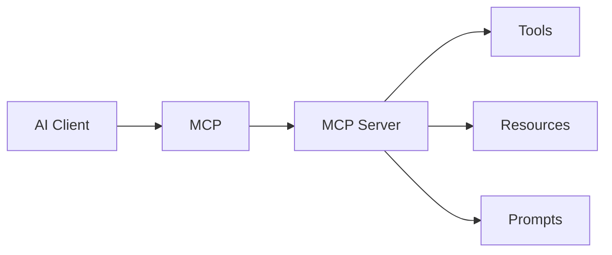

# Tổng quan MCP và Tool Protocols

MCP, Model Context Protocol, giải quyết một vấn đề thực tế: làm sao một AI application có thể kết nối với nhiều công cụ và nguồn dữ liệu theo một interface tương đối chuẩn. Thay vì mỗi sản phẩm tích hợp tool theo cách riêng, MCP đưa ra mô hình client, server, tools, resources và prompts.

Điểm quan trọng là MCP không tự làm agent thông minh hơn. MCP làm môi trường hành động của agent có cấu trúc hơn. Khi tool boundary rõ, schema rõ và permission rõ, agent có thể gọi công cụ an toàn hơn và dễ audit hơn.

## MCP trong một câu

MCP là lớp giao tiếp giữa AI client và capability server. AI client có thể là IDE agent, desktop assistant hoặc orchestration runtime. MCP server cung cấp công cụ như đọc issue, query database, search docs, gọi internal API hoặc thao tác file theo quyền được cấp.

## Vì sao cần protocol

Không có protocol, mỗi tool integration là một kết nối riêng, khó reuse, khó kiểm soát và khó audit. Với protocol, ta có thể mô tả capability theo schema, log tool calls, tách quyền theo server và thay client mà không viết lại toàn bộ backend.

## Nhưng MCP không giải quyết tất cả

MCP không tự quyết định tool nào an toàn, output nào đáng tin, secret nào được phép đọc, hay agent có nên gọi tool đó không. Những câu hỏi này thuộc về Agentic Engineering. Protocol là nền móng, còn governance là cách vận hành trên nền móng đó.
