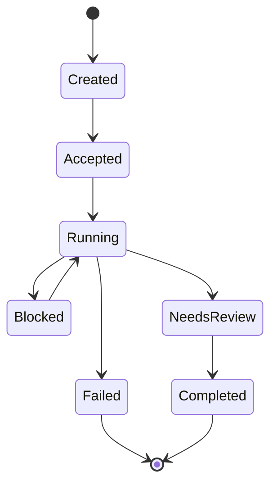

# Identity, State và Contract trong A2A

Agent-to-agent communication chỉ có ý nghĩa khi ta biết ai đang nói, nói với quyền nào, đang xử lý trạng thái nào và kết quả được cam kết ra sao. Nếu thiếu bốn yếu tố đó, hệ thống nhiều agent dễ biến thành một nhóm chatbot trao đổi tự do, trông có vẻ hợp tác nhưng rất khó tin cậy.

Trong distributed systems, ta không bao giờ chỉ gửi text rồi hy vọng service kia hiểu đúng. Ta định nghĩa API, schema, auth, retry, timeout và error code. Với agent-to-agent, nguyên tắc đó vẫn đúng, nhưng payload phức tạp hơn vì nó chứa mục tiêu, context, artifact và reasoning summary.

## Identity

Identity trả lời câu hỏi: agent này là ai và đại diện cho ai. Một coding reviewer agent có quyền khác một deployment agent. Một agent chạy dưới tài khoản cá nhân khác agent chạy dưới service account. Nếu mọi agent dùng cùng một token admin, audit gần như vô nghĩa.

Identity nên có ba lớp:

| Lớp | Ý nghĩa |
|---|---|
| User identity | Người khởi tạo hoặc chịu trách nhiệm |
| Agent identity | Agent hoặc role đang hành động |
| Tool identity | Credential dùng để gọi hệ thống đích |

Ba lớp này không nên bị trộn. Khi incident xảy ra, ta cần biết user nào yêu cầu, agent nào quyết định và tool credential nào thực hiện.

## State

Agent-to-agent task thường có state: created, accepted, running, blocked, failed, completed, needs-review. Nếu không có state machine, agent gửi không biết agent nhận đang làm gì. Agent nhận cũng không biết khi nào cần báo lại.

Một state machine đơn giản giúp hệ thống dễ debug:



## Contract

Contract trong A2A không chỉ là message schema. Nó còn là cam kết về outcome. Ví dụ, khi reviewer agent nhận task, nó phải trả về findings có severity, evidence và recommendation. Nếu chỉ trả về “looks good”, kết quả quá nghèo để audit.

Một contract tốt nên có:

```yaml
task_id: stable id
sender: planner-agent
receiver: reviewer-agent
goal: review security risk in auth changes
context_refs:
  - pull_request: 123
  - files_changed: [...]
constraints:
  - no code edits
  - report only evidence-backed findings
expected_artifact: structured_review
timeout: 15m
failure_policy: return blocked with reason
```

## Capability discovery

Agent không nên giao task cho agent khác chỉ vì tên nghe phù hợp. Nó cần biết capability, limit và cost của agent nhận. Capability discovery có thể đơn giản như một manifest: agent này review code, không sửa code, không truy cập production, timeout 20 phút.

## Kết luận

A2A không phải “cho agent chat với nhau”. A2A là thiết kế contract giữa các thực thể có identity, state và responsibility. Khi ba yếu tố này rõ, multi-agent system mới có cơ hội đi từ demo sang engineering.
