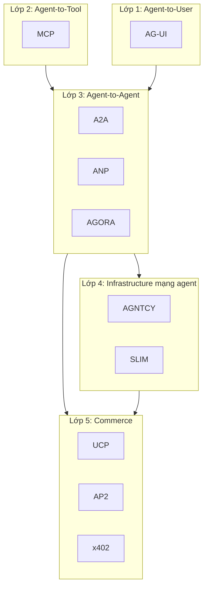

# Bản đồ Protocol Agent năm 2026

Trong vòng 18 tháng từ cuối 2024 tới đầu 2026, hệ sinh thái agent đã chứng kiến hơn một chục protocol mới ra đời. Một số trở thành chuẩn công nghiệp, một số gộp vào nhau, một số vẫn ở dạng đề xuất nghiên cứu, một số là nhãn marketing không có tài sản kỹ thuật bền vững. Chương này dựng một bản đồ rõ ràng để người đọc không bị ngợp bởi số lượng tên gọi.

## Lý do có nhiều protocol

Một câu hỏi tự nhiên là vì sao cần nhiều protocol đến vậy. Câu trả lời là chúng giải quyết các lớp khác nhau của bài toán agent. Khi tách lớp, danh sách dài lập tức gọn lại.

Tách theo lớp giúp ta hiểu lý do tồn tại. MCP đứng ở lớp tool. A2A và ANP đứng ở lớp agent-to-agent. AGNTCY đứng ở lớp infrastructure mạng. AP2, x402 và UCP đứng ở lớp commerce. AG-UI đứng ở lớp tương tác người dùng. Các protocol cùng lớp cạnh tranh hoặc bổ sung; các protocol khác lớp xếp chồng lên nhau.

## Dòng thời gian rút gọn

| Thời điểm | Sự kiện |
|---|---|
| 11/2024 | Anthropic công bố MCP |
| 3/2025 | OpenAI áp dụng MCP; Cisco mở mã AGNTCY; IBM BeeAI giới thiệu ACP |
| 4/2025 | Google công bố A2A; Anthropic công bố MCP cập nhật |
| 5/2025 | Coinbase công bố whitepaper x402 |
| 6/2025 | MCP spec phiên bản 2025-06-18 (OAuth Resource Server); A2A chuyển về Linux Foundation |
| 7/2025 | AGNTCY chuyển về Linux Foundation |
| 8/2025 | ACP gộp vào A2A dưới Linux Foundation |
| 9/2025 | Google công bố AP2 cùng Coinbase và hơn 60 tổ chức |
| 1/2026 | Google công bố UCP cùng các nhà bán lẻ lớn |
| 4/2026 | A2A đạt 150 tổ chức; embedded ở các cloud platform |

Bài học chính từ timeline này là tốc độ hợp nhất nhanh hơn tốc độ tăng. ACP gộp vào A2A. AGNTCY tích hợp với A2A và MCP. AP2 mở rộng A2A và MCP. UCP xếp chồng lên A2A, MCP và AP2. Nhiều “protocol” mới nghe có vẻ rời rạc nhưng thực ra là extension hoặc lớp ở trên các protocol cốt lõi.

## Bảng tham chiếu nhanh

| Protocol | Lớp | Người dẫn dắt | Trạng thái | Quan hệ chính |
|---|---|---|---|---|
| MCP | Agent-to-tool | Anthropic, công bố Nov 2024 | Production, công nghiệp adoption rộng | Nền cho tool access của mọi agent |
| A2A | Agent-to-agent | Google, nay Linux Foundation | Production, 150+ tổ chức | Chuẩn hóa giao tiếp giữa agent |
| ACP | Agent-to-agent | IBM BeeAI | Đã gộp vào A2A từ 8/2025 | Migration path tới A2A |
| ANP | Agent-to-agent decentralized | ANP Team, W3C CG | Đặc tả, vẫn đang phát triển | DID-based, mở internet hóa |
| AGORA | Meta-protocol | Đại học Oxford | Nghiên cứu | NL-to-protocol generation |
| AGNTCY | Network infrastructure | Cisco Outshift, Linux Foundation | Đang triển khai sản xuất | Discovery + Identity + SLIM + Observability |
| SLIM | Messaging transport | Cisco, AGNTCY | Production-ready trong AGNTCY | gRPC, pub/sub, mTLS |
| AP2 | Payments | Google + Coinbase + 60+ tổ chức | Đặc tả công khai, sample code | Extend A2A và MCP |
| x402 | Payment rail | Coinbase, Cloudflare x402 Foundation | Production, USDC + multi-chain | HTTP 402, có thể plug vào AP2 |
| UCP | Commerce | Google + retail/payment lớn | Mới ra, đang triển khai retail | Xếp trên A2A, MCP, AP2 |
| AG-UI | Agent-to-user UI | CopilotKit | Niche, growing | Cầu nối frontend |

## Các tên đáng làm rõ

Trong các cuộc thảo luận, một số tên hay bị nhắc lẫn lộn.

“A2C” trong ngữ cảnh agent protocol không phải chuẩn công nghiệp đã thiết lập. Trong reinforcement learning, A2C là Advantage Actor-Critic, không liên quan tới giao thức agent. Nếu nghe nói “A2C protocol”, hãy xác minh nguồn vì có khả năng đó là cách gọi không chính thức hoặc nhãn của một sản phẩm riêng.

“Universal Context Protocol” đôi khi được dùng như cách gọi chung cho MCP, không phải protocol riêng.

“Agent Connect Protocol” đôi lúc xuất hiện trong tài liệu mới, là một nhánh đặc tả nội bộ AGNTCY và liên quan tới ACP-cũ; sau khi ACP gộp vào A2A, các đặc tả này được hợp nhất.

## Quy luật vận động đã thấy

Sau 18 tháng quan sát, có một số quy luật rõ.

Quy luật thứ nhất là hội tụ về lớp. Khi nhiều protocol cạnh tranh ở cùng một lớp, hệ sinh thái thường hợp nhất chứ không sống chung lâu dài. Ví dụ rõ nhất là ACP gộp vào A2A.

Quy luật thứ hai là phân lớp dọc. Các protocol mới xuất hiện ở lớp khác chứ không thay thế trực tiếp protocol cũ. UCP xếp trên A2A và MCP thay vì thay chúng.

Quy luật thứ ba là governance quyết định độ bền. Protocol được chuyển về tổ chức trung lập có open governance (Linux Foundation, W3C, x402 Foundation) bền hơn protocol nằm trong tay một công ty duy nhất.

Quy luật thứ tư là tooling kéo theo adoption. Protocol có SDK đa ngôn ngữ, sample code chạy được và tích hợp sẵn vào IDE phổ biến lan nhanh hơn nhiều so với protocol chỉ có whitepaper.

## Các chương tiếp theo

Bốn chương sau đi sâu hơn vào các protocol có giá trị thực tiễn nhất tại thời điểm hiện tại: MCP, A2A và sự gộp với ACP, ANP và AGORA cho hướng đi decentralized và meta-protocol, AGNTCY và SLIM cho infrastructure mạng agent, AP2 và x402 và UCP cho commerce. Chương cuối đưa ra khung quyết định khi nào nên đầu tư vào protocol nào và khi nào nên bỏ qua.
