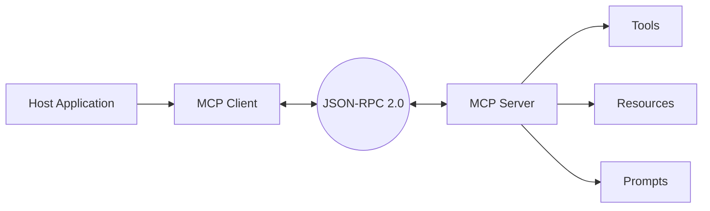

# MCP đi sâu

Model Context Protocol do Anthropic công bố tháng 11/2024 là protocol đầu tiên đạt mức adoption công nghiệp cho lớp agent-to-tool. Năm 2025, OpenAI, Google DeepMind, GitHub, Microsoft, Cloudflare và phần lớn các IDE phổ biến đã tích hợp MCP. Khi nói “agent có thể dùng tool một cách chuẩn hóa”, ta đang nói về MCP trong phần lớn các trường hợp.

## Vấn đề MCP giải quyết

Trước MCP, mỗi tích hợp giữa LLM và một hệ thống bên ngoài là một dự án riêng: tự định nghĩa schema, tự xử lý auth, tự sinh code stub cho từng model. Với hàng nghìn tool tiềm năng và nhiều model khác nhau, chi phí tích hợp tăng theo tích hai. MCP đưa ra một interface chuẩn: model nói cùng một ngôn ngữ với tool, tool đăng ký capability theo cùng một schema, các bên thứ ba có thể viết server một lần và dùng cho nhiều client.

So sánh thường gặp là “MCP là cổng USB-C cho AI”. Không hoàn toàn chính xác về kỹ thuật, nhưng giúp người đọc hiểu vai trò: chuẩn hóa kết nối, không quyết định nội dung được chuyển.

## Kiến trúc tổng quát

MCP có ba thành phần chính.

Client là phần trong host application: IDE, chat app, agent runtime. Client mở phiên với server, hỏi capability, gọi tool.

Server expose tool, resource, prompt và elicitation. Server có thể chạy local trên cùng máy hoặc remote qua HTTP.

Protocol layer định nghĩa JSON-RPC 2.0 với handshake initialize, capability negotiation, lifecycle, tool list, tool call, resource read, prompt list và các tính năng sampling và elicitation.

## Lifecycle và capability negotiation

Một phiên MCP bắt đầu bằng initialize. Client gửi version, capability mong muốn, info danh tính. Server trả về version, capability mà server hỗ trợ, info server. Sau đó client gửi notifications/initialized, phiên chuyển sang ACTIVE.

Trong ACTIVE, client có thể gọi `tools/list`, `tools/call`, `resources/list`, `resources/read`, `prompts/list`. Server có thể notify client khi danh sách tool thay đổi qua `tools/list_changed`. Khi xong, một bên gửi shutdown.

Capability negotiation cho phép client và server cùng version mới hơn vẫn giao tiếp được với version cũ hơn nếu cả hai khai báo cùng capability tối thiểu. Đây là cơ chế quan trọng để protocol tiến hóa mà không phá tích hợp đang chạy.

## Transport

Transport mặc định gồm stdio cho server local và HTTP cho server remote. HTTP transport có hai mode: stateful với SSE và stateless với request-response độc lập. Mode stateless được giới thiệu chính thức từ spec 2025-06-18, cho phép server scale ngang như HTTP API bình thường. Đặc điểm này được phân tích chi tiết hơn trong Phần 3.

## Authorization

MCP từ spec 2025-06-18 coi server là OAuth 2.1 Resource Server. Client phải lấy access token theo OAuth từ Authorization Server riêng, rồi gửi token kèm Resource Indicators (RFC 8707) để chỉ định scope tới đúng server. Đây là thay đổi quan trọng so với MCP đời đầu, nơi auth dựa trên cấu hình thủ công.

Quan trọng phải lưu ý: spec có quy định không có nghĩa mọi implementer làm đúng. Trong thực tế, một số MCP server bỏ qua auth, một số dùng API key tĩnh, một số mặc định trust client. Khi review production, hãy kiểm chứng implementation thật, không dựa vào spec.

## Tool, Resource, Prompt và những tính năng phụ

Một MCP server expose bốn loại capability chính.

Tool là hàm có side effect tiềm tàng. Client gọi `tools/call` với tên và arguments theo schema. Server trả về structured result hoặc error.

Resource là tham chiếu tới dữ liệu read-only như file, URL hoặc record database. Client lấy danh sách qua `resources/list`, đọc nội dung qua `resources/read`.

Prompt là template có tham số mà server đề xuất cho client. Đây là cách server hướng dẫn cách dùng tool một cách an toàn.

Elicitation cho phép server hỏi thêm thông tin từ user qua client. Sampling cho phép server yêu cầu client sinh text từ một model. Hai tính năng này mở rộng MCP từ một protocol gọi tool thuần thành một protocol giao tiếp hai chiều mềm dẻo hơn.

## Bảo mật và rủi ro thực tế

MCP mở ra power lớn nhưng cũng đi kèm risk lớn.

Risk thứ nhất là user consent không rõ. Server có thể expose tool nguy hiểm mà UI client không trình bày đầy đủ. Nguyên tắc trong spec là user phải hiểu và đồng ý từng action, nhưng tuân thủ phụ thuộc UI.

Risk thứ hai là untrusted server. Một MCP server cài thêm vào IDE có thể đọc file, gọi LLM bằng prompt độc hại, hoặc lừa user. Cộng đồng đã có nhiều phân tích về marketplace MCP server và rủi ro supply chain.

Risk thứ ba là prompt injection qua tool output. Tool output từ web hoặc tài liệu không tin cậy có thể chứa instruction nhúng. Phần 8 của tài liệu này đã thảo luận sâu cách phòng thủ.

Risk thứ tư là tool có scope rộng. Một tool “run_shell” gọn gàng trong demo trở thành cửa hậu khi expose vào production. Tool nên có scope hẹp, dry-run, approval, redaction và logging đầy đủ.

## Khi nào nên dùng và khi nào không

Dùng MCP khi: muốn agent kết nối với hệ thống có sẵn, muốn một interface chung cho nhiều client, hoặc muốn rời khỏi vendor lock-in.

Cân nhắc không dùng MCP khi: tool quá đơn giản và chỉ phục vụ một client cụ thể (function calling native có thể đủ), khi requirement bảo mật yêu cầu protocol nội bộ tùy biến, hoặc khi latency là yếu tố tối quan trọng và overhead JSON-RPC qua HTTP là không chấp nhận được.

## Mức giá trị thực tiễn

MCP là một trong số rất ít protocol agent đã thực sự đạt mức “phải biết” cho người làm việc nghiêm túc trong agentic systems. Adoption đến từ Anthropic, OpenAI, Google, IDE lớn và cộng đồng MCP server đông. Đầu tư thời gian học MCP có ROI rõ ràng trong cả ngắn và dài hạn.
