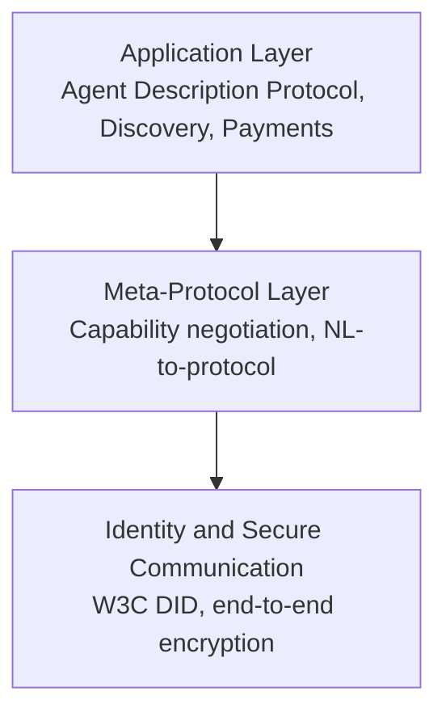

# ANP và AGORA, hướng decentralized và meta-protocol

A2A và MCP giải quyết bài toán giao tiếp trong một liên minh các tổ chức đồng thuận về danh tính và quản trị. Còn khi không có liên minh đó thì sao. Khi hai agent thuộc hai tổ chức không biết nhau, không có OAuth chung, không có registry trung tâm, làm sao chúng nhận diện và tin nhau. Đó là không gian của các protocol decentralized như Agent Network Protocol, và của các meta-protocol như AGORA.

## ANP: agent internet với DID

Agent Network Protocol đề xuất xây “HTTP của thời đại agent internet”. Mục tiêu là cho phép hàng tỷ agent thuộc các bên khác nhau giao tiếp mà không phụ thuộc registry trung tâm.

Kiến trúc ANP có ba lớp.

Lớp Identity dùng W3C Decentralized Identifier. Mỗi agent tự host một DID document tại domain của mình. Hai agent ở hai nền tảng khác nhau xác thực nhau bằng cách fetch DID document và kiểm chữ ký. Không có authority trung tâm.

Lớp Meta-Protocol định nghĩa cách các agent thương lượng giao thức bằng ngôn ngữ tự nhiên. Hai agent có thể đề xuất, sửa và thống nhất một protocol con cho tương tác cụ thể.

Lớp Application gồm Agent Description Protocol, discovery, và các extension như payment.

ANP đang ở giai đoạn đặc tả với whitepaper công bố tháng 8/2025 và một số implementation tham chiếu. W3C AI Agent Protocol Community Group đang chuẩn hóa các phần dựa trên ANP.

## Giá trị thực tiễn của ANP

ANP hấp dẫn về tầm nhìn nhưng vẫn ở giai đoạn sớm. Ưu điểm rõ là tính decentralized: không phụ thuộc Linux Foundation, không phụ thuộc một cloud, không phụ thuộc một registry. Nhược điểm là mọi cơ chế dựa trên DID đòi hỏi tooling, hosting và operations phức tạp hơn so với một AgentCard công bố tại `/.well-known/agent.json`.

Cho team production năm 2026, ANP chưa nên là default. Nó đáng để theo dõi nếu bạn xây nền tảng cross-organization, marketplace agent công khai, hoặc product trong không gian Web3 và decentralized identity. Với phần lớn workload enterprise, A2A vẫn là lựa chọn pragmatic.

## AGORA: meta-protocol bằng ngôn ngữ tự nhiên

AGORA xuất phát từ Đại học Oxford và đại diện cho một cách tiếp cận khác hẳn. Thay vì cố định một schema, AGORA dùng năng lực hiểu ngôn ngữ tự nhiên của LLM để sinh ra protocol tạm thời cho từng cuộc giao tiếp.

Quy trình rút gọn của AGORA:

1. Hiểu yêu cầu. Một agent điều phối phân tích natural language request, tách thành phần cấu trúc (ví dụ: travel details, budget, constraint).
2. Sinh protocol. Agent điều phối sinh ra Protocol Document tạm thời theo cấu trúc đó.
3. Routing. Protocol document được gửi tới các agent chuyên môn phù hợp.
4. Trả lời. Mỗi agent chuyên môn xử lý theo protocol document, trả về kết quả có cấu trúc.

Ý tưởng cốt lõi là protocol không cần được chuẩn hóa từ trước. Nó được sinh ra theo task. Khi task thay đổi, protocol thay đổi.

## Giá trị thực tiễn của AGORA

AGORA là ý tưởng đẹp về mặt khái niệm. Nó giải quyết được trường hợp các agent không có chuẩn chung. Nhưng có ba điểm cần lưu ý.

Thứ nhất, độ tin cậy phụ thuộc model. Nếu LLM sinh sai protocol document, mọi agent sau đó nhận sai input.

Thứ hai, eval và audit khó hơn. Protocol thay đổi mỗi task làm trace khó so sánh.

Thứ ba, security khó hơn. Mỗi protocol mới là một bề mặt tấn công mới.

Trong thực tế năm 2026, AGORA hữu ích như một concept nghiên cứu và như một module trong các agent điều phối, không phải protocol mặt định cho hệ thống production.

## So sánh ngắn

| Tiêu chí | A2A | ANP | AGORA |
|---|---|---|---|
| Mô hình tin cậy | Liên minh có governance trung lập | Decentralized với DID | Tùy thuộc model |
| Discovery | AgentCard + `/.well-known/agent.json` | DID document trên domain agent | Sinh theo task |
| Identity | OAuth và scheme bên ngoài | W3C DID | Không quy định |
| Mức ổn định | Production, 150+ tổ chức | Đặc tả, đang chuẩn hóa | Nghiên cứu |
| Phù hợp nhất | Enterprise và cross-vendor có governance | Cross-organization mở | Concept và prototype |

## Khi nào trong cùng hệ thống

A2A, ANP và AGORA không phải mutually exclusive. Một enterprise có thể dùng A2A nội bộ, expose một vài agent ra ngoài qua ANP cho marketplace mở, và dùng AGORA-like protocol làm cơ chế giao tiếp tạm thời giữa các agent thử nghiệm. Cách thiết kế đa lớp như vậy hiếm nhưng không vô lý.

## Kết luận

ANP và AGORA mở rộng tưởng tượng về cách agent có thể giao tiếp khi không có liên minh trung tâm. Cả hai đều có giá trị nghiên cứu rõ ràng. Cho production năm 2026, đầu tư chính vẫn nên ở A2A. ANP đáng theo dõi cho future, AGORA đáng đọc để hiểu hướng meta-protocol và một số kỹ thuật của nó có thể dùng trong điều phối agent.
