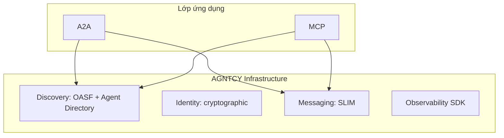

# AGNTCY và SLIM, Internet of Agents

Trong lúc MCP chuẩn hóa lớp agent-to-tool và A2A chuẩn hóa lớp agent-to-agent, vẫn còn lớp infrastructure: làm sao hàng triệu agent từ nhiều tổ chức tìm ra nhau, xác thực, gửi message với độ trễ thấp, quan sát hành vi tổng thể, và làm điều đó ở quy mô internet. AGNTCY do Cisco Outshift khởi xướng, sau đó chuyển về Linux Foundation, đặt mục tiêu giải quyết lớp này. Họ gọi tầm nhìn là Internet of Agents.

## AGNTCY khác A2A và MCP ở đâu

AGNTCY không cạnh tranh với A2A hay MCP. Nó nằm ở dưới. A2A định nghĩa cách hai agent nói chuyện. AGNTCY định nghĩa cách hàng triệu agent tìm ra nhau, có danh tính, và trao đổi message hiệu quả. AGNTCY mô tả mình như cơ sở hạ tầng truyền thông cho hệ thống probabilistic phân tán.

Bốn trụ cột của AGNTCY.

Discovery với Open Agent Schema Framework và một Agent Directory phân tán. OASF là schema mô tả capability, dependency và metadata của agent. Directory hoạt động như DNS cho agent.

Identity cho agent với khả năng chứng minh bằng mã hóa, không phụ thuộc vendor.

Messaging qua SLIM (Secure Low-Latency Interactive Messaging), một transport được thiết kế cho giao tiếp agent đa modality và low-latency.

Observability với SDK chuyên cho hệ thống probabilistic, bắt được trace và metric xuyên agent.

## SLIM, transport cho agent

SLIM là phần dễ thấy nhất của AGNTCY trong code. Nó là một messaging layer chạy trên gRPC với các đặc điểm:

- Pub/sub cho fan-out tới nhiều agent.
- Channel-based routing thay vì point-to-point cứng.
- mTLS và RBAC ở mức transport.
- Hỗ trợ message streaming và multi-modal payload.
- Quantum-safe security design đã được cân nhắc từ đầu.

SLIM phù hợp khi hệ thống có nhiều agent giao tiếp đồng thời, có streaming dài, hoặc khi cần latency thấp hơn JSON-RPC qua HTTP thuần. Nó không thay thế A2A; nó có thể làm transport cho thông điệp A2A trong môi trường yêu cầu hiệu năng cao.

## Discovery với OASF và Agent Directory

OASF cung cấp schema chung để mô tả agent một cách máy hiểu được. Mỗi agent có một manifest OASF ghi rõ capability, dependency, version, requirement runtime, license, và các tag bổ sung.

Agent Directory là dịch vụ phân tán cho phép publish và discover các manifest này. Tương tự DNS cho agent: bạn không cần biết IP của agent, bạn hỏi directory để lấy endpoint.

A2A và MCP có thể tận dụng directory này. Một AgentCard A2A có thể tham chiếu một manifest OASF chi tiết hơn. Một MCP server có thể được tìm qua directory thay vì cấu hình tay.

## Identity và observability

Identity của AGNTCY giúp agent có “passport” chống giả mạo. Khi hai agent tương tác lần đầu, chúng xác thực qua chữ ký mã hóa thay vì dựa vào secret chia sẻ.

Observability SDK của AGNTCY được thiết kế cho đặc thù agent: probabilistic behavior, multi-step task, nhiều tool, nhiều side effect. Trace không chỉ ghi “hàm A gọi hàm B” mà còn ghi decision context, candidate options và path không được chọn. Đây là điểm khác biệt so với observability cổ điển cho microservices.

## Production patterns đã thấy

AGNTCY đã có một số use case production công bố.

Một là multi-agent voice platform: một công ty xây nền tảng giọng nói nhiều agent dùng identity của AGNTCY và SLIM messaging.

Hai là SRE automation: một team xây trợ lý SRE đa agent thay thế 30% workload SRE bằng AGNTCY làm infrastructure giao tiếp.

Ba là network configuration: nhà mạng dùng AGNTCY trong tool nội bộ để tự động hóa migration và validation.

Bốn là reference application coffeeAGNTCY: một ứng dụng multi-agent multi-organization làm mẫu, tích hợp A2A, MCP và AGNTCY. Tương tự Sock Shop trong cộng đồng CNCF, nó là ví dụ để developer fork và thử.

## Giá trị thực tiễn

AGNTCY có giá trị rõ trong các tình huống sau:

- Hệ thống có nhiều agent từ nhiều team hoặc nhiều tổ chức cần phát hiện nhau dynamic.
- Yêu cầu latency thấp và throughput cao cho giao tiếp agent.
- Cần observability sâu cho hệ thống probabilistic ở quy mô.
- Quan tâm tới quantum-safe security trong dài hạn.

AGNTCY chưa cần thiết khi team nhỏ, agent ít, deploy đơn giản. Trong tình huống đó, A2A và MCP plus một service registry thông thường là đủ.

Mức giá trị: đáng theo dõi và đáng đầu tư cho enterprise platform team. Không phải mặc định cho mọi prototype.

## Kết hợp với A2A và MCP

Cách kết hợp ba protocol thường thấy:

- Mỗi agent expose AgentCard A2A và manifest OASF.
- Discovery dùng Agent Directory của AGNTCY.
- Identity dùng cryptographic identity của AGNTCY.
- Transport cho task A2A có thể chuyển sang SLIM khi cần hiệu năng.
- Tool access vẫn qua MCP.
- Observability dùng SDK AGNTCY thống nhất xuyên agent.

Sự kết hợp này cho thấy các protocol không cạnh tranh nhau, mà bổ sung theo lớp. Một team production có thể chọn từng lớp riêng và ghép lại.
