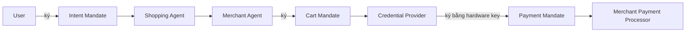

# Agentic Commerce, AP2 và x402 và UCP

Khi agent có thể đọc dữ liệu, gọi tool và giao tiếp với agent khác, câu hỏi kế tiếp xuất hiện rất nhanh: agent có thể mua hàng và thanh toán không. Trả lời câu hỏi này dẫn tới một họ protocol mới ở lớp commerce: Agent Payments Protocol của Google, x402 của Coinbase, và Universal Commerce Protocol của Google cùng các nhà bán lẻ lớn. Ba protocol này khác nhau về phạm vi nhưng phối hợp với nhau và đều xếp chồng lên A2A và MCP.

## Vì sao lớp commerce cần protocol riêng

Hệ thống thanh toán hiện tại giả định một người đang ngồi trước trình duyệt và xác nhận giao dịch. Agent thay thế con người tạo ra ba khoảng trống:

- Authorization. Làm sao chứng minh user đã ủy quyền cho agent mua món hàng này, với điều kiện này.
- Authenticity. Làm sao merchant chắc rằng request từ agent phản ánh đúng intent của user.
- Accountability. Khi giao dịch gian lận xảy ra, ai chịu trách nhiệm: user, agent platform hay merchant.

Lớp commerce mới phải trả lời ba câu hỏi này một cách có thể audit và pháp lý chấp nhận được.

## AP2, Agent Payments Protocol

AP2 do Google công bố tháng 9/2025 cùng Coinbase và hơn 60 tổ chức. Nó là extension của A2A và MCP, không thay thế chúng.

AP2 dựa trên hệ ba mandate là Verifiable Credentials có chữ ký mã hóa.

Intent Mandate. User ký một mandate xác lập intent: agent được phép tìm và mua một loại sản phẩm với một số ràng buộc (giá tối đa, hạn dùng, danh mục, đối tượng). Đây là cấp quyền có giới hạn.

Cart Mandate. Khi agent đã chọn sản phẩm cụ thể, merchant ký một Cart Mandate xác nhận giỏ hàng. Cart Mandate gắn vào Intent Mandate ban đầu để chứng minh giỏ hàng nằm trong scope user đã ủy quyền.

Payment Mandate. Khi đủ điều kiện, user (hoặc credential provider thay mặt user trên thiết bị hardware-backed) ký Payment Mandate. Payment Mandate gắn vào Cart Mandate, hash hóa thông tin nhạy cảm và trở thành bằng chứng pháp lý cho giao dịch.

Vai trò được tách rõ. Shopping Agent biết intent của user nhưng không biết payment credential. Credential Provider nắm payment credential nhưng không biết chi tiết task. Merchant Payment Processor không biết identity user.

AP2 không gắn cứng vào một payment rail. Nó hỗ trợ thẻ tín dụng, debit, real-time bank transfer, stablecoin và x402.

## x402, lớp payment cho HTTP

x402 do Coinbase công bố whitepaper tháng 5/2025 và Cloudflare cùng lập x402 Foundation. Nó dùng HTTP status code 402 “Payment Required” cũ kỹ và gán cho nó một schema hoàn chỉnh.

Luồng x402 rất gọn.

1. Buyer request một resource.
2. Server trả về 402 với header `PAYMENT-REQUIRED` mô tả yêu cầu.
3. Buyer ký một payment payload và gửi lại với header `PAYMENT-SIGNATURE`.
4. Server verify và settle qua Facilitator (do Coinbase hoặc bên khác cung cấp).
5. Server trả resource và header `X-PAYMENT-RESPONSE` với hash giao dịch.

Đặc điểm của x402:

- Native HTTP, không cần API key hay account riêng.
- USDC là asset đầu tiên, nhưng spec chain-agnostic. Đã có triển khai trên Base, Polygon, Arbitrum, World, Solana.
- Micropayment dưới $0.001 fee, settle dưới 2 giây.
- x402 Foundation là governance trung lập, không một công ty controll.

x402 phù hợp cho pay-per-call API, metered compute, paywall content, và đặc biệt cho agent-to-API trực tiếp không qua người.

## UCP, Universal Commerce Protocol

UCP do Google công bố tháng 1/2026 cùng Shopify, Etsy, Wayfair, Target, Walmart và được endorse bởi Visa, Mastercard, Stripe, Adyen.

UCP đặt mục tiêu chuẩn hóa toàn bộ hành trình thương mại agent-mediated, không chỉ phần thanh toán. Nó bao gồm:

- Business profile để merchant công bố capability, danh mục, discount, payment options.
- Cart support và product catalog access cho agent.
- Direct checkout từ AI Mode trong Google Search và Gemini app.
- Transport linh hoạt: standard API, A2A, MCP.
- Tích hợp AP2 cho phần payment authorization.

UCP không thay AP2 hay x402. Nó là lớp thương mại bên trên, AP2 lo phần thanh toán có ủy quyền, x402 có thể là rail thực tế khi dùng stablecoin.

## Quan hệ ba protocol

| Khía cạnh | UCP | AP2 | x402 |
|---|---|---|---|
| Phạm vi | Toàn bộ commerce journey | Authorization và mandate chain | Payment rail HTTP-native |
| Xếp chồng | Trên A2A, MCP, AP2 | Trên A2A và MCP | Có thể là rail trong AP2 hoặc dùng độc lập |
| Asset | Mọi loại | Mọi loại payment instrument | USDC và stablecoin, chain-agnostic |
| Quản trị | Google + retail consortium | Google + 60+ tổ chức | x402 Foundation |
| Trạng thái | Mới (1/2026), đang rollout retail | Đặc tả công khai, sample code | Production, library nhiều ngôn ngữ |

## Rủi ro của lớp commerce agent

Lớp commerce mở ra rủi ro mới mà engineering phải hiểu trước khi triển khai.

Rủi ro thứ nhất là agent confusion. Một agent bị prompt injection có thể mua sai sản phẩm. Mandate chain của AP2 giảm tác hại nhưng không loại bỏ.

Rủi ro thứ hai là pháp lý chưa rõ. Ai chịu trách nhiệm khi giao dịch tự động lệch ý user. Các mandate có chữ ký giúp audit nhưng luật pháp vẫn đang hình thành.

Rủi ro thứ ba là fragmentation. Mỗi merchant tích hợp UCP có thể có scope riêng. Agent gặp policy mâu thuẫn giữa các merchant phải xử lý ra sao.

Rủi ro thứ tư là dependency tài chính. x402 dùng stablecoin, phụ thuộc vào USDC và blockchain rail. Một biến động hạ tầng có thể tác động chuỗi.

Rủi ro thứ năm là privacy. Phân tách role giữa Shopping Agent, Credential Provider và Payment Processor giúp giảm exposure nhưng không xóa nó.

## Giá trị thực tiễn

Lớp commerce là không gian có ROI rõ nhất sau MCP và A2A nếu bạn ở các domain sau:

- E-commerce muốn cho phép AI agent mua qua interface chuẩn.
- Fintech và payment provider muốn vào agent economy.
- API provider muốn pay-per-call cho agent không có account.
- Platform muốn enable commerce trong sản phẩm AI của họ.

Nếu bạn ở các domain khác, AP2 và UCP là “đáng biết để hiểu xu hướng”, không phải “phải triển khai ngay”. x402 đáng thử ở pilot ngay cả với team nhỏ vì độ phức tạp tích hợp thấp.

## Kết luận

AP2, x402 và UCP cùng tạo ra một stack commerce mới cho agent. Mỗi protocol giải quyết một lớp khác nhau và phối hợp với nhau qua các điểm mở rộng đã thiết kế. Khi quyết định đầu tư, hãy xác định domain của bạn trước. Lớp commerce là một trong những không gian protocol agent có sản phẩm thật, đối tác thật và dòng tiền thật, nhưng cũng là không gian có nhiều rủi ro vận hành nhất.
