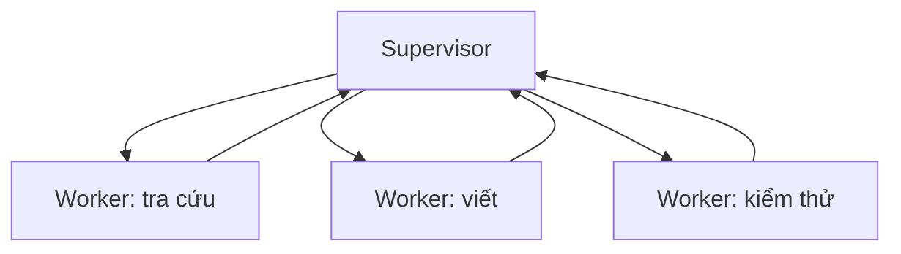

# Supervisor và Editorial patterns

Khi một team có vài agent, câu hỏi đầu tiên không phải “làm sao để chúng nói chuyện”, mà là “ai chịu trách nhiệm quyết định cuối”. Trả lời câu hỏi đó dẫn tới hai họ pattern thực dụng: supervisor và editorial. Hai pattern này khác nhau ở chỗ chia trách nhiệm và ở chỗ artifact cuối được tạo ra như thế nào.

## Supervisor

Supervisor là một agent có vai trò điều phối. Nó nhận yêu cầu, chia task, giao cho worker phù hợp, theo dõi tiến độ và quyết định khi nào dừng. Worker thường chuyên sâu: một worker chạy tool, một worker tra cứu, một worker viết. Supervisor giữ mô hình tổng thể của task.

Supervisor mạnh khi task có phân rã tự nhiên và worker thực sự bổ trợ nhau. Supervisor yếu khi nó không thấy đủ dữ liệu để ra quyết định, hoặc khi worker cần thông tin lẫn nhau mà phải đi vòng qua supervisor.

## Hierarchical supervisor

Khi quy mô lớn, một supervisor không đủ. Ta có thể tạo nhánh: một supervisor lớp ngoài chia task thành nhóm, mỗi nhóm có supervisor con quản worker. Pattern này giúp giảm độ phức tạp ngữ cảnh ở mỗi node nhưng tăng overhead phối hợp. Hãy dùng khi nhóm task thực sự độc lập, không phải để “có cấu trúc cho có”.

## Editorial pattern

Editorial pattern xây dựng artifact qua nhiều vòng: writer, critic, editor. Writer tạo draft. Critic đọc kỹ và đưa nhận xét theo rubric. Editor gộp nhận xét, sửa draft hoặc yêu cầu writer sửa. Vòng này lặp lại tới khi tiêu chí dừng đạt được.

Editorial mạnh khi artifact cần cải thiện qua nhiều vòng nhỏ và khi tiêu chí chất lượng có thể mô tả rõ. Editorial yếu khi critic không có rubric, khi critic và writer dùng cùng model với cùng bias, hoặc khi không có tiêu chí dừng.

## Critic không phải tự đánh giá

Một sai lầm phổ biến là dùng cùng một model, cùng một prompt cho writer và critic, rồi gọi đó là “self-evaluation”. Cách này thường hợp thức hóa output kém vì critic có xu hướng đồng ý với writer. Để critic có giá trị, ít nhất phải khác về rubric, dữ liệu kiểm chứng hoặc nguồn evidence. Tốt hơn nữa là critic có quyền truy cập tool kiểm chứng độc lập.

## Editorial pattern và artifact boundary

Editorial pattern đặc biệt hữu ích cho task tạo nội dung: tài liệu, báo cáo, code review, draft policy. Trong những task này, artifact cuối là một văn bản có rubric chất lượng. Khi rubric rõ, editorial pattern dễ hội tụ. Khi rubric mơ hồ, vòng lặp dễ kéo dài vô ích.

## Khi nào không dùng multi-agent

Multi-agent không phải mặc định tốt hơn single-agent. Nếu task có thể được làm bởi một agent với context tốt và tool đủ, thêm agent chỉ làm tăng cost, latency và bề mặt lỗi. Một số dấu hiệu nên giảm số agent:

- Hai agent chỉ trao đổi để khẳng định nhau.
- Một agent luôn fail vì thiếu context mà agent kia có.
- Artifact cuối không thay đổi đáng kể giữa các vòng.

## Bảng quyết định

| Tình huống | Pattern phù hợp |
|---|---|
| Task có phân rã rõ thành nhóm độc lập | Supervisor |
| Quy mô lớn, nhiều nhóm độc lập | Hierarchical supervisor |
| Artifact cần cải thiện qua vòng | Editorial |
| Cần phản biện chất lượng | Editorial với critic độc lập |
| Task đơn giản, một agent có đủ context | Single agent |

## Kết luận

Supervisor và editorial là hai cách hữu ích để tổ chức nhiều agent quanh trách nhiệm rõ. Đừng chọn pattern theo độ phức tạp nghe có vẻ ấn tượng. Hãy chọn pattern theo cách trách nhiệm được phân chia và cách artifact cuối được kiểm chứng.
