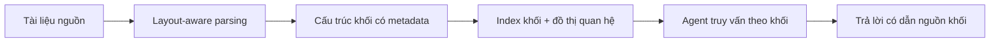

# Agentic Document Workflows

Tài liệu thực tế hiếm khi là văn bản phẳng. Chúng có bảng số liệu, biểu đồ, ảnh chụp, sơ đồ, chú thích, mục lục, ghi chú phía dưới và phụ lục. Khi đưa các tài liệu này vào agent một cách thô, ta thường thấy hai vấn đề: chi phí token bùng nổ và độ chính xác giảm vì agent nhìn nhầm bố cục. Agentic Document Workflows, viết tắt ADW, là tập hợp các kỹ thuật để biến tài liệu phức tạp thành dữ liệu agent có thể dùng hiệu quả.

## ADW khác RAG vector phẳng ở đâu

RAG vector phẳng cắt tài liệu thành chunk rồi tìm theo tương đồng. Cách này phù hợp với corpus đồng nhất và câu hỏi đơn giản. Nó kém khi tài liệu có cấu trúc hỗn hợp, khi câu hỏi cần ghép số từ bảng với mô tả từ văn bản, hoặc khi nguồn cần được dẫn lại chính xác để audit.

ADW thay vì coi tài liệu là chuỗi ký tự, coi nó là một cấu trúc gồm nhiều khối có loại: paragraph, heading, table, figure caption, formula, list, code. Mỗi khối được trích xuất với metadata về vị trí trang, định danh tài liệu và liên hệ với khối khác.

## Pipeline điển hình

Các bước chính gồm:

1. Layout-aware parsing để nhận diện loại khối thay vì chỉ trích xuất text.
2. Chuẩn hóa dữ liệu trong từng khối, ví dụ bảng được giữ dạng có hàng và cột, không bị làm phẳng.
3. Lưu metadata: trang, vị trí, định danh tài liệu, ngôn ngữ, version.
4. Xây index theo nhu cầu: vector cho ngữ nghĩa, full-text cho cụm từ chính xác, graph cho quan hệ giữa khối.
5. Agent truy vấn ở mức khối, dẫn nguồn ở mức khối, không “trích đoạn mờ”.

## Vì sao trích xuất khối làm agent đáng tin hơn

Khi agent thấy bảng dạng bảng, nó dễ trả lời câu hỏi số liệu. Khi agent thấy hình kèm caption, nó hiểu được ngữ cảnh hình. Khi agent thấy heading kèm subsection, nó biết phạm vi ngữ cảnh. Mỗi cải thiện nhỏ này gộp lại làm giảm hiện tượng “hallucinated citation” và “mismatched figure reference”.

Quan trọng không kém là khả năng trả lời kèm nguồn ở mức khối. Reviewer có thể click về đúng trang, đúng vị trí. Đây là yêu cầu cơ bản cho mọi pipeline tài liệu doanh nghiệp.

## ADW kết hợp memory

ADW không thay thế memory architecture. Ngược lại, hai thứ bổ trợ nhau. Block-level index là lớp tra cứu chính xác. Semantic memory là nơi lưu quyết định, ràng buộc và pattern thường gặp. Khi agent gặp tài liệu mới, ADW giúp đọc; memory giúp nhớ.

## Anti-patterns

- Trả lời từ chunk dài 2000 token nhưng không nêu được khối nào trong tài liệu nguồn.
- Trích xuất bảng thành text dòng dẫn tới mất quan hệ hàng và cột.
- Bỏ qua header và footer, làm mất phạm vi.
- Gộp nhiều tài liệu khác nhau vào một index không có nhãn nguồn.
- Cập nhật tài liệu mới nhưng không version index, làm agent trộn version cũ và mới.

## Checklist sẵn sàng ADW

| Câu hỏi | Yêu cầu tối thiểu |
|---|---|
| Tài liệu có phân loại khối không? | Có |
| Bảng có giữ cấu trúc không? | Có |
| Câu trả lời có dẫn nguồn ở mức khối không? | Có |
| Index có version theo tài liệu không? | Có |
| Có policy cho tài liệu nhạy cảm không? | Có, gồm redaction và scope |

## Kết luận

ADW không phải là kỹ thuật mới hoàn toàn, nhưng nó định hình cách đưa tài liệu thực tế vào agent một cách đáng tin. Khi pipeline tài liệu đủ tốt, các phần khác của hệ thống có thể nhẹ đi rất nhiều: ít token hơn, ít hallucination hơn, audit dễ hơn, và evaluation có nền tảng rõ.
