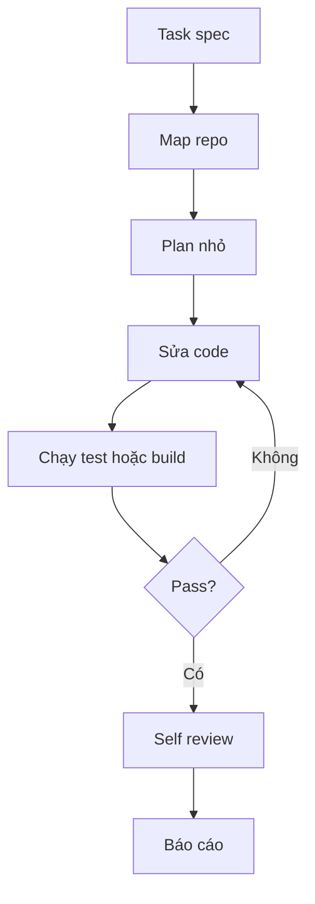

# Case Study Coding Agent

Một coding agent trong repo thật cần nhiều hơn khả năng viết code. Nó cần hiểu architecture, tìm đúng file, sửa nhỏ, chạy test, đọc lỗi và báo cáo trade-off.

## Thiết kế runtime

Flow cơ bản:

## Context cần có

Coding agent cần `AGENT.md`, scripts trong `package.json`, folder map, test strategy và convention. Nếu thiếu, agent nên đọc trước khi sửa.

## Rủi ro

- Sửa quá rộng.
- Không chạy test.
- Tin vào output build cũ.
- Xóa code vì tưởng unused.
- Ghi secret vào log hoặc docs.

## Completion checklist

- Diff nhỏ và đúng scope.
- Test hoặc build đã chạy.
- Không có secret.
- Có ghi rõ phần chưa verify nếu thiếu dependency.
