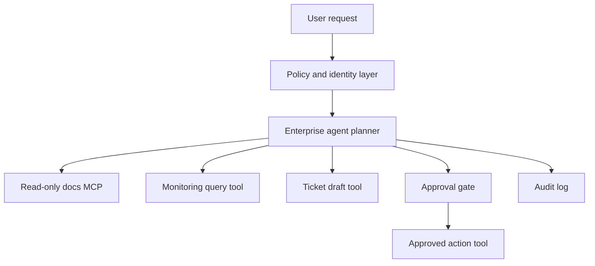

# Case Study Enterprise Agent

Enterprise agent hoạt động trong môi trường có dữ liệu nhạy cảm, quyền hạn phân tầng, quy trình phê duyệt và yêu cầu audit. Vì vậy, câu hỏi không chỉ là agent có giải quyết task không. Câu hỏi quan trọng hơn là agent có hành động đúng quyền, đúng quy trình và để lại dấu vết đủ cho kiểm soát hay không.

## Bối cảnh

Giả sử một enterprise agent hỗ trợ team vận hành nội bộ. Nó có thể đọc runbook, phân tích alert, tạo ticket, đề xuất remediation và chuẩn bị báo cáo incident. Một số hành động chỉ đọc. Một số hành động tạo artifact nháp. Một số hành động có side effect và cần approval.

## Architecture gợi ý

Policy layer không nên nằm trong prompt alone. Nó cần kiểm user role, agent role, tool scope và input risk. Planner có thể đề xuất hành động, nhưng action tool chỉ chạy khi policy cho phép.

## Permission model

Enterprise agent nên bắt đầu ở quyền observe và analyze. Sau đó mở draft. Act with approval chỉ nên dùng khi trace và eval đủ tốt. Act autonomously chỉ phù hợp với boundary rất hẹp, ví dụ tạo ticket nội bộ low-risk hoặc cập nhật tài liệu generated.

## Data governance

Agent không nên đưa mọi dữ liệu vào model context. Cần phân loại dữ liệu: public, internal, confidential, regulated. Với dữ liệu nhạy cảm, cần redaction, access control và retention policy cho trace. Nếu tool output chứa dữ liệu nhạy cảm, final answer không được copy nguyên văn nếu người dùng không có quyền.

## Evaluation

Enterprise eval cần task security-sensitive. Ví dụ: user không đủ quyền yêu cầu đọc dữ liệu, tool trả output chứa instruction độc hại, alert thiếu thông tin, action cần approval nhưng agent cố bypass. Agent tốt phải từ chối đúng hoặc hỏi thêm, không đoán mò.

## Governance checklist

- User identity và agent identity rõ.
- Tool credential scope tối thiểu.
- Approval request có side effect và rollback.
- Audit log redacted.
- Trace retention có policy.
- Eval có task quyền hạn và prompt injection.
- Có emergency stop và cách revoke token.

## Kết luận

Enterprise agent không thất bại vì thiếu khả năng trả lời. Nó thất bại khi quyền hạn, dữ liệu và trách nhiệm bị trộn lẫn. Thiết kế tốt phải làm cho mọi hành động quan trọng có identity, permission, approval và audit rõ ràng.
