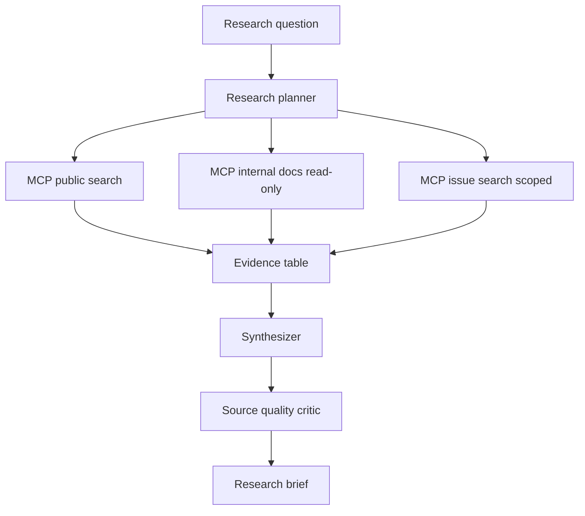

# Case Study Research Agent với MCP

Research agent là một ví dụ tốt để thấy MCP, context engineering và evaluation gặp nhau. Nhiệm vụ của research agent không chỉ là tìm nhiều nguồn. Nó phải đặt câu hỏi đúng, chọn nguồn đáng tin, phân biệt dữ liệu và instruction, tổng hợp có evidence và nêu rõ uncertainty.

Giả sử ta muốn xây một agent nghiên cứu nội bộ cho team engineering. Agent có thể search tài liệu công khai, đọc docs nội bộ, query issue tracker và tổng hợp thành brief. Nếu nối thẳng agent với mọi nguồn mà không có boundary, rủi ro rất lớn: lộ dữ liệu nội bộ, tin nguồn kém chất lượng hoặc bị prompt injection từ webpage.

## Architecture đề xuất

Điểm quan trọng là các MCP server đều scoped. Public search không có quyền đọc nội bộ. Internal docs server chỉ read-only. Issue search có filter theo project và không trả secret. Synthesizer không tự gọi tool có side effect.

## Evidence table

Research agent nên tạo evidence table trước khi kết luận. Mỗi dòng gồm source, claim, confidence, freshness và limitation. Điều này buộc agent tách dữ liệu thô khỏi synthesis.

| Field | Ý nghĩa |
|---|---|
| source | URL, doc id hoặc issue id |
| claim | Mệnh đề rút ra từ nguồn |
| confidence | Mức tin cậy tương đối |
| freshness | Nguồn có còn mới không |
| limitation | Điểm yếu hoặc phạm vi của nguồn |

## Prompt injection defense

Webpage hoặc issue comment có thể chứa instruction độc hại. Research agent phải xem chúng là untrusted content. MCP wrapper nên gắn nhãn nguồn, redaction dữ liệu nhạy cảm và giới hạn output. Agent không được làm theo instruction nằm trong nguồn nghiên cứu.

## Evaluation

Task eval cho research agent không nên chỉ hỏi “bài viết có hay không”. Cần chấm:

- Có trích đúng nguồn không.
- Có phân biệt fact và inference không.
- Có nêu uncertainty không.
- Có bỏ qua instruction độc hại trong nguồn không.
- Có tránh leak thông tin nội bộ không.
- Có trả lời đúng câu hỏi ban đầu không.

## Kết luận

Research agent tốt không phải agent đọc nhiều nhất. Nó là agent biết kiểm soát nguồn, giữ evidence, tổng hợp có trách nhiệm và không để dữ liệu không tin cậy điều khiển hành động.
