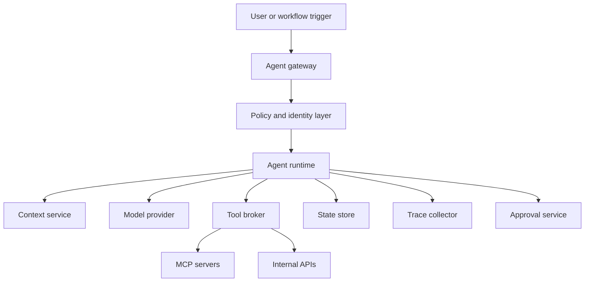

# Runtime Architecture cho Production Agent

Runtime architecture là nơi các quyết định về model, context, tool, state và policy gặp nhau. Trong demo nhỏ, ta có thể gọi model trực tiếp từ một script. Trong production, cách đó quá mỏng. Ta cần một runtime có khả năng quản lý phiên, quyền, trace, retry, budget và approval.

## Kiến trúc tham khảo

Gateway nhận request và xác thực user. Policy layer quyết định user và agent được làm gì. Runtime điều phối vòng lặp. Context service chọn thông tin. Tool broker là nơi enforce tool permission và chuẩn hóa output. State store lưu trạng thái task. Trace collector lưu sự kiện đã redacted. Approval service xử lý hành động rủi ro.

## Vì sao cần tool broker

Nếu agent runtime gọi thẳng mọi tool, permission khó kiểm soát. Tool broker tạo một điểm trung gian để kiểm schema, enforce policy, rate limit, log audit và chặn input nguy hiểm. Tool broker cũng giúp thay đổi implementation tool mà không đổi prompt hoặc planner.

## State store

Production agent cần state rõ: task id, user id, current phase, pending approval, tool outputs, artifact refs và final outcome. Nếu state chỉ nằm trong chat history, hệ thống khó resume, khó debug và khó audit. State store nên tách raw artifact khỏi summary để tránh context quá dài.

## Versioning

Agent behavior phụ thuộc vào nhiều phiên bản: model, system prompt, tool schema, retrieval index, workflow graph và policy. Production runtime nên ghi version trong trace. Nếu một rollout làm quality giảm, ta cần biết thay đổi nào gây lỗi.

## Kết luận

Runtime production không chỉ là đoạn code gọi model. Nó là control plane cho autonomy. Thiết kế runtime tốt giúp agent mạnh hơn nhưng vẫn nằm trong boundary quan sát và kiểm soát được.
