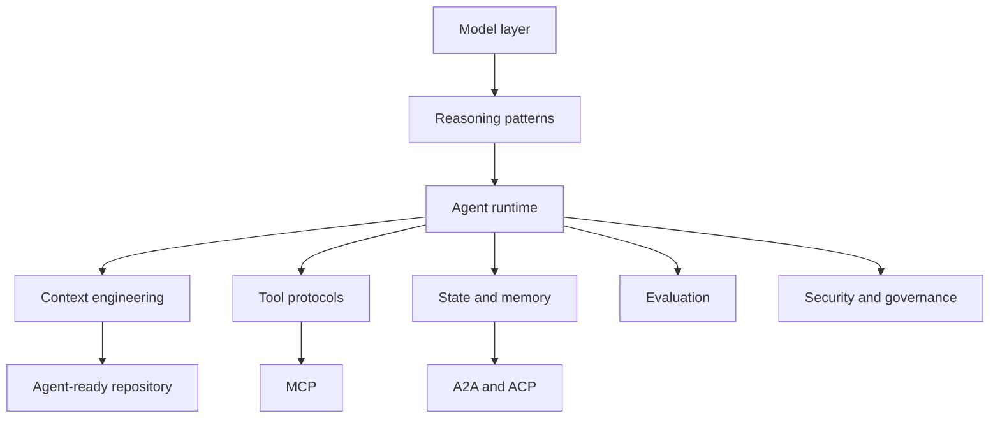

# Agentic Engineering Map

Trang này là bản đồ cô đọng của toàn bộ cuốn sách. Mục tiêu là giúp người đọc thấy các chủ đề không rời rạc. MCP, A2A, `AGENT.md`, skills, workflow, eval và security đều là những lát cắt khác nhau của cùng một bài toán: làm sao biến model thành một hệ thống hành động có kiểm soát.

## Bản đồ lớp

## Các câu hỏi nối các phần

| Câu hỏi | Phần liên quan |
|---|---|
| Agent khác chatbot ở đâu? | Phần 0, Phần 1 |
| Agent biết làm gì trong repo? | Phần 2, Phần 6 |
| Agent dùng tool thế nào? | Phần 3 |
| Nhiều agent phối hợp ra sao? | Phần 4, Phần 5 |
| Biết agent tốt hơn bằng cách nào? | Phần 7 |
| Ngăn agent gây hại thế nào? | Phần 8 |
| Chọn công cụ theo tiêu chí nào? | Phần 9 |
| Áp dụng vào hệ thống thật ra sao? | Phần 10 |

## Công thức thực dụng

Một agentic system đáng tin thường cần đủ sáu yếu tố:

1. Goal rõ.
2. Context đúng.
3. Tool boundary rõ.
4. State có thể quan sát.
5. Eval có thể lặp lại.
6. Permission và governance có enforcement.

Thiếu một yếu tố, hệ thống vẫn có thể demo được. Nhưng để vận hành nghiêm túc, sáu yếu tố này phải cùng xuất hiện.
